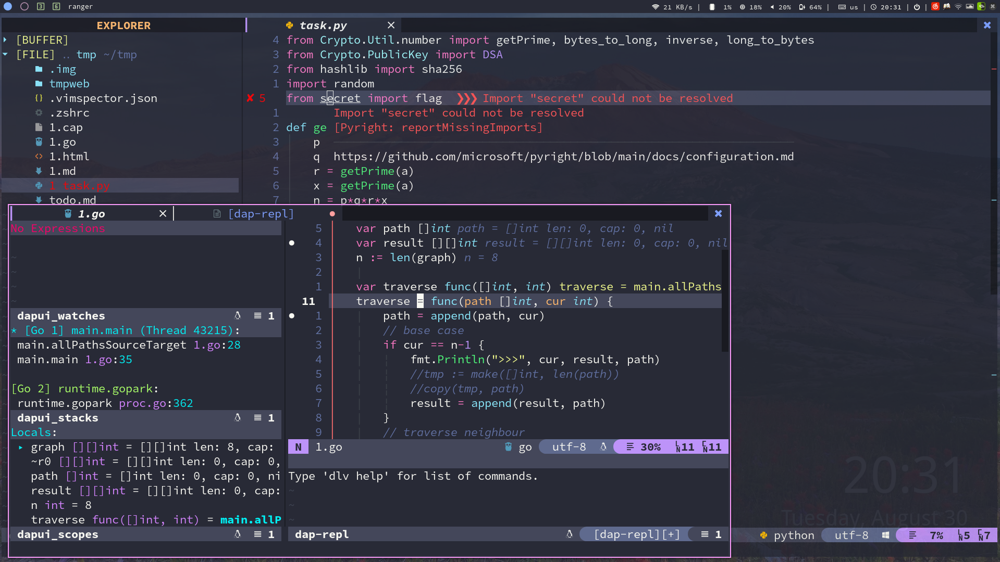

# myconfig

[English](./README.md) | 简体中文

本项目存储 Linux 下各种软件的配置文件，帮助我快速配置 Linux 桌面环境。

<div align=center>  </div>

## 快速开始

将本项目克隆到 home 目录。注意：此项目不能从 home 目录删除。

```sh
sudo pacman -Sy git paru python3 curl wget
git clone --recursive https://github.com/wakaka6/myconfig.git $HOME/myconfig
# 如果在虚拟机上，使用以下命令克隆
git clone -b vm --recursive https://github.com/wakaka6/myconfig.git $HOME/myconfig
```

然后，安装前置软件

```sh
paru -S the_silver_searcher neovim lazygit ripgrep fd delta fzf rofi tealdeer zoxide
```

文件管理器

```sh
paru -S thunar filezilla
```

美化

```sh
sudo pacman -S picom feh variety polybar-git arc-gtk-theme papirus-icon-theme adapta-gtk-theme arc-icon-theme
# 配置 GTK 主题
sudo pacman -S lxappearance
# 配置 i3 主题
sudo pacman -S kvantum

# 图形化的 sudo 认证
sudo pacman -S polkit-gnome
```

Shell

```sh
sudo pacman -S zsh starship
```

增强 i3

```sh
# 类似 bspwm 的螺旋平铺
paru -S autotiling

# 通过标签可视化聚焦窗口
paru -S wmfocus
```

AwesomeWM（i3 的替代方案）

```sh
sudo pacman -S awesome
# 必需依赖
paru -S picom rofi alacritty xclip warpd
```

Nerd 字体

```sh
paru -S ttf-unifont siji-git ttf-font-awesome

paru -S ttf-linux-libertine ttf-inconsolata ttf-joypixels ttf-twemoji-color noto-fonts-emoji ttf-liberation ttf-droid

paru -S ttf-jetbrains-mono-nerd

# 中文字体
paru -S wqy-bitmapfont wqy-microhei wqy-microhei-lite wqy-zenhei adobe-source-han-mono-cn-fonts adobe-source-han-sans-cn-fonts adobe-source-han-serif-cn-fonts
```

如果在虚拟机上运行，执行以下命令

```sh
pacman -S open-vm-tools-desktop
```

ranger 前置依赖（可选）

```sh
pacman -S ranger highlight atool w3m poppler mediainfo ueberzug zathura-pdf-mupdf
```

yazi 前置依赖（可选，推荐）

> yazi 比 ranger 更好，更快。

```sh
pacman -S yazi ffmpeg 7zip jq poppler imagemagick ueberzugpp
```

Neovim 前置依赖

```sh
sudo pacman -S neovim python-pynvim
sudo pacman -S python-pip
pip install pynvim
pip install jedi
curl -sL install-node.now.sh/lts | bash
sudo pacman -S xdotool
```

LaTeX 前置依赖

```sh
paru -S texlive texlive-lang biber
```

传统软件的现代替代

```sh
sudo pacman -S lsd htop duf
```

其他软件

```sh
sudo pacman -S flameshot
sudo pacman -S network-manager-applet
sudo pacman -S libreoffice-still
sudo pacman -S dunst # 通知
# 翻译软件
sudo pacman -S goldendict
sudo pacman -S translate-shell
sudo pacman -S remmina freerdp # RDP 工具

# 输入法
sudo pacman -S fcitx5-im # 基础包组
sudo pacman -S fcitx5-chinese-addons # 官方中文输入引擎
# sudo pacman -S fcitx5-anthy # 日文输入引擎
paru -S fcitx5-pinyin-moegirl # 萌娘百科词库
sudo pacman -S fcitx5-pinyin-zhwiki # 中文维基百科词库
sudo pacman -S fcitx5-material-color # 主题
```

最后，运行此命令

```sh
cd ~/myconfig && ./auto_config.sh install && reboot
```

## Claude Code

安装 Claude Code 以获得 AI 辅助功能。参考 https://claude.com/product/claude-code 获取安装说明。

安装后，awesome 配置提供快捷访问：

- `mod+g` - 打开 Claude Code 草稿本
- `mod+/` - 使用 Claude 查询选中文本
